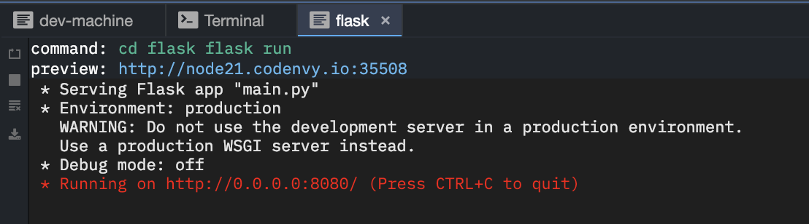

# First Flask Project Notes

0. [Context](#context)
1. [Virtual Environments](#virtual-environments)
2. [Importing](#importing)
3. [Static Files](#static-files)
4. [Block Content](#block-content)
5. [Requests](#requests)
6. [Dotenv](#dotenv)

## Context

This isn't a professional grade application - it doesn't include authentication or a database. It does, however, expose students to the concept of a Model-View-Controller framework.

The goal here is to understand and experiment with HTTP methods, the major parts of an MVC framework, the movement of information between parts of the application, and the separation of concerns.

This example app goes a little deeper than most students will go after just two weeks of programming (e.g. block content, virtual environments), but we wanted to put down some learnings as a reference so that you'll be ready to answer questions your students might have this summer.

## Virtual Environments

### Local setup

If you're developing locally, you'll want to install all your packages in a virtual environment. This allows you to make changes to your python configuration in whatever way best suits your application without modifying your system's python setup.

To do this, use the following suite of commands for the following purposes.

Create a python virtual environment. You only need to do this once.
```bash
python3 -m venv venv
```

Every time you want to do any of the following:
* run your app
* install packages
You need to activate the virtual environment.
```bash
. venv/bin/activate
```

If, for some reason, you need to leave the virtual environment, all you need to do is deactivate it.
```bash
deactivate
```

### Codenvy setup

HOWEVER, since our workspaces on codenvy.io are essentially virtual environments already, this setup is unnecessary.

Furthermore, even though a virtual environment will work once within Codenvy, the IDE will modify a lot behind the scenes if you stop and restart a workspace, and I have yet to find a simple solution outside of destroying and recreating the venv files, so not only is a virtual environment unnecessary in the Codenvy IDE, it adds a layer of complexity that is downright unhelpful for students.

With Codenvy, the only tricky part is setting up the run command. Since the preview URL is created dynamically, the ports and ip addresses you create NEED to match codenvy's internal setup, and even when that's done correctly, there's no way to identify the preview URL's exact server and port without using the built-in command tool.

You'll need to create a new run command.


Then you'll need to script out the series of shell commands that would let you start up a server.


Here's the code for copy-paste purposes:
```bash
cd <your-directory-name-here>
export FLASK_APP=main.py
export FLASK_RUN_HOST=0.0.0.0
export FLASK_RUN_PORT=8080
export FLASK_DEBUG=1
flask run
```

And finally, you'll need to output the generated preview URL.


Here's the code for copy-paste purposes:
```bash
http://${server.port.8080}
```

Frustratingly, this doesn't stop flask itself from outputting the (incorrect) internal preview address. The external address (in blue) will work for students; the internal address (in red) will not.



it's also worth noting that since codenvy doesn't play nicely with hidden files like .git and .flaskenv, we're going to store the commands in this run command. But normally, you'd use the .flaskenv file to store the following code:
```bash
FLASK_APP=main.py
FLASK_RUN_HOST=0.0.0.0
FLASK_RUN_PORT=8080
FLASK_DEBUG=1
```

The host and port NEED to be set to these values in order for the app to run in Codenvy. The debug value allows for hot reloading (the server resets any time students change their files), and the FLASK_APP simply tells Flask where to start.


## Importing

Importing relative files within a flask app confused me for a while.

I thought the relative paths would be based on the location of the file that does the importing, but in fact, it appears to assume root for all import paths. It's ultimately not that hard to fix, but it was hard for me to wrap my head around, so here's the upshot: using the syntax `from models import jumbler` in `routes.py` will throw an error, despite the fact that routes.py and the models directory are adjacent.

Most of the resources I found online recommended using importlib, but since we're already covering a LOT of new concepts with students, I want to keep the number of extensions we cover with students as low as possible. To that end, I wanted to see if there was a built-in way to access a script to separate concerns without adding in additional extensions.

After a frustrating hour or so debugging, it turns out the correct way to do this is to path to scripts THROUGH the app that's already been imported: `from app.models import jumbler`.

Then, you can use `jumbler.function_name()` as often as you like within the context of your app.  

## Static Files

Files that you want publicly accessible (image files, stylesheets, etc) need to go in the specially named `static` directory.

Then, when you want to reference them, you can either hardcode the url starting with the word 'static', or you can use Flask's `url_for()` function.

```html
<!-- Option 1, using the url_for() function -->
<link rel="stylesheet" type="text/css" href={{ url_for('static',filename='index.css') }}>
<!-- Option 2, using a hardcoded path -->
<link rel="stylesheet" type="text/css" href="static/index.css">
```

The `url_for()` function is better practice long-term, and it's also what students will see most often as they're referencing documentation, but for the small-scale apps we're building, it might be better practice to hardcode the path so that students get more exposure to the syntax they'll see more universally.

## Block Content

Flask allows for you to extend templates (much like react components and Node templates do). For example, this app recycles `base.html` in almost every page. Then the dynamic content is embedded with the `` code.

You then use this wrapper by indicating that any given page `` and then the content of that page is wrapped in the same tags used on the base.html page: `...YOUR_HTML_HERE...`

As far as writing dry code (with navbars, etc), this concept is REALLY useful and satisfying, but for students who are spinning up their first app, this isn't necessary to get something up and running. For that reason, we expect our teachers to know it, but we don't expect this to necessarily be demonstrated in any student projects.

## Requests

Most online documentation recommends using the WTForms module, but this has a lot to do with validating form data, and again, since we're already covering a LOT of new concepts with students, I want to keep the number of additional modules/extensions/packages we cover with students as low as possible.

For that reason, we're using Flask's request module: `from flask import request
`.

The request has several properties, and the one we're interested in is .form (since our data is posted via a form). That data comes back as an immutableMultiDict, which is similar to what students are used to dealing with, but won't work with the exact same methods as before.

That's why the first thing we're doing to make this more similar to student context is converting the form data back to a dictionary: `userdata = dict(request.form)`.

Now that our form data is in a normal dictionary, we can access it using the same syntax we usually do.

With that said, we've also written in some error handling here in case someone tries to access the page via a GET request (without sending the appropriate form data):

```python
if request.method == 'GET':
  return render_template('404.html')
else:
  # Code to handle a POST request.
```

## Dotenv

Locally, a `.flaskenv` helps set up settings so you don't have to run them manually each time you start up a new terminal. you also have to install the package so it knows to run that script each time.

```bash
pip install python-dotenv
touch .flaskenv
```

Unfortunately, Codenvy literally and immutably hides files with a `.` prefix, so you CANNOT edit them in the editor. There are a few workarounds (like using a CL editor like VIM or changing the filename with `mv .flaskenv flaskenv` before editing and then back with `mv flaskenv .flaskenv` afterwards), but ultimately, it just makes a lot more sense to embed the requirements into the [run command](#codenvy-setup).
